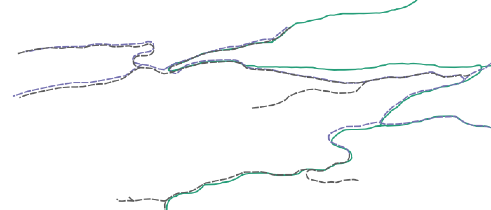

# roadintegrator

Collect and combine various BC road data sources in order of priority. When a lower priority road feature is within 7m (or otherwise specified) of a higher priority road, it is snapped to the the location of the higher priority road using the ArcGIS [Integrate tool](http://desktop.arcgis.com/en/arcmap/latest/tools/data-management-toolbox/integrate.htm).  Once all sources are snapped/integrated, roads from each source are added to the output in order of priority - if the road is not already present.

## Limitations and Caveats

The authoritative source for built roads in British Columbia is the [Digital Road Atlas](https://catalogue.data.gov.bc.ca/dataset/digital-road-atlas-dra-master-partially-attributed-roads). The road integration process used in these scripts is an approximation and the output created is specifically for cumulative effects analysis. It is intended for strategic level analysis and should not be considered positionally accurate or used for navigation.

The output dataset contains line work from many sources, some representing built roads and some representing road tenures. Potential issues include:

- duplicates of the same road defined in different sources that are not within the integration distance (7m) (see [Duplications](#Duplications) below)
- roads that have not been built
- roads that are overgrown or otherwise impassible
- existing roads that are not mapped in any of the noted sources will not be included (ie, some roads may be missed)

## Requirements

Four scripts are provided:

For `1_prep.py`, `3_merge.py`, `4_dump.sh`:

- Python 3 (tested with v3.7)
- GDAL/OGR (tested with v2.4.0)
- PostgreSQL (tested with v11.2)
- PostGIS with [SFCGAL](http://postgis.net/2015/10/25/postgis_sfcgal_extension/) (tested with v2.5.1)

For `2_integrate.py`:

- ArcGIS Desktop (tested with v10.6.1)
- Python 2.7

## Setup

1. On data preparation machine (with GDAL, Postgres), clone the repository,
create virtualenv, install Python dependencies:

        $ git clone https://github.com/bcgov/roadintegrator.git
        $ cd roadintegrator
        $ virtualenv venv
        $ venv\Scripts\activate
        $ pip install -r requirements.txt

2. On ArcGIS machine, clone the repositiory, install dependencies. Also, the tool requires the [64bit ArcGIS Python](http://desktop.arcgis.com/en/arcmap/latest/analyze/executing-tools/64bit-background.htm) - integrate will fail with topology errors using the 32bit Python. The PATH setting below is for ArcGIS 10.6 on a BC Gov GTS server, modify as required:

        C:\> git clone https://github.com/smnorris/roadintegrator.git
        C:\> cd roadintegrator
        C:\roadintegrator> pip install --user click
        C:\roadintegrator> pip install --user pyaml
        C:\roadintegrator> SET PATH="E:\sw_nt\Python27\ArcGISx6410.6";"E:\sw_nt\Python27\ArcGISx6410.6\Scripts";%PATH%

## Configuration

### config.yml
To modify processing tolerances and default database/files/folders, edit `config.yml`.

### sources.csv
To modify the source layers used in the analysis, edit the file referenced as `source_csv` in `config.yml`. The default source data list file is the provided `sources.csv`. This table defines all layers in the analysis and can be modified to customize the analysis. Note that order of the rows is not important, the script will sort the rows by the **priority** column. Columns are as follows:

| COLUMN                 | DESCRIPTION                                                                                                                                                                            |
|------------------------|----------------------------------------------------------------------------------------------------------------------------------------------------------------------------------------|
| **priority**               | An integer defining the priority of the source. Lower priority roads will be snapped to higher priority roads (within the specified tolerance). Sources required for processing but not included in the roads hierarchy (eg tiles) should be give a hierarchy value of `0`.
| **manual_download**        | 'Y' if the data must be manually downloaded
| **name**                   | Full name of the source layer
| **alias**                  | A unique underscore separated value used for coding the various road sources (eg `dra`)
| **source_table**           | Full SCHEMA.TABLE object name of source BCGW table
| **primary_key**            | The source layer's primary key
| **fields**                 | The fields in the source layer to retain in the output, in order to be written to output layer
| **url**                    | DataBC Catalogue URL
| **query**                  | A valid CQL or ECQL query for filtering the data (https://docs.geoserver.org/stable/en/user/tutorials/cql/cql_tutorial.html)
| **preprocess_operation**   | Pre-processing operation to apply to layer (`tile` and `roadpoly2line` are the only supported operations)

Note that this tool only supports downloading sources available through the DataBC Catalogue.

## Usage

1. Create the postgres database if it doesn't already exist:

        $ python 1_prep.py create-db

2. Download publicly accessible data:

        $ python 1_prep.py load

3. Manually download any sources that are not publicly accessible and load to the working database (using the alias specified in `sources.csv` with the suffix `_src`. For example:

        $ ogr2ogr \
          --config PG_USE_COPY YES \
          -f PostgreSQL \
          PG:"host=localhost user=postgres dbname=roadintegrator password=postgres" \
          -lco OVERWRITE=YES \
          -lco SCHEMA=public \
          -lco GEOMETRY_NAME=geom \
          -nln abr_src \
          source_data/ABR.gdb \
          ABR_ROAD_SECTION_LINE

4. Preprocess (tile inputs and generate linear features from polygon inputs):

        $ python 1_prep.py preprocess

5. Move the resulting `temp_data/prepped.gdb` to equivalent folder on a machine with ArcGIS 10.6/Python 2.7. and then run the road integration:

        C:\path\to\project> python 2_integrate.py

6. Move the resulting `temp_data/tiles` back to equivalent folder on the machine with Python 3 / GDAL etc and merge the tiled outputs in postgres:

        $ python 3_merge.py

7. Dump output `integrated_roads` layer to final .gdb. Note that this script does read `sources.csv` or `config.yml`, the script must be modified if any changes are made to input data and/or the postgres connection.

        $ ./4_dump.sh

## Duplications
As mentioned above, the analysis is very much an approximation. It works best in areas where roads are not duplicated between sources.
These diagrams illustrate a problematic sample area, showing three input road layers (green as highest priority) and the resulting output (using a 7m tolerance).

### three input layers

### resulting output

